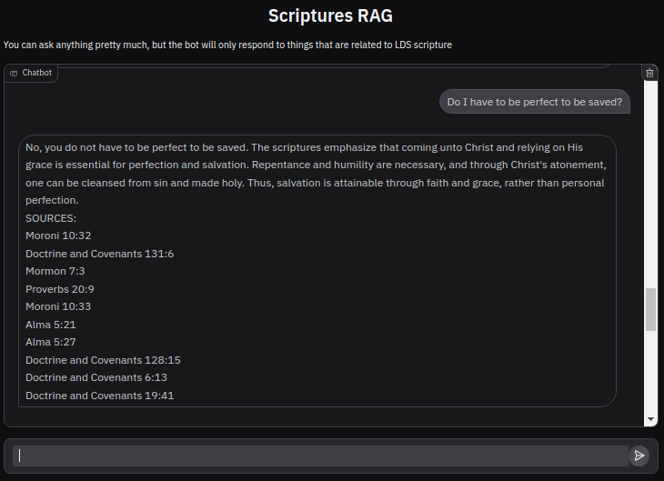
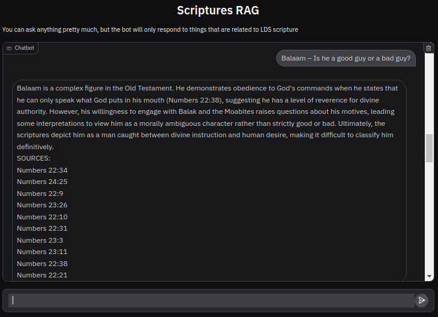
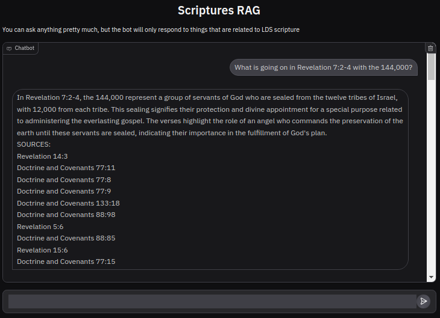
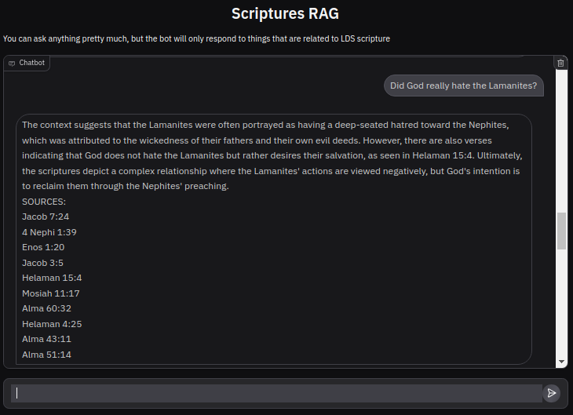

# RAG pipeline based on the Church of Jesus Christ of Latter Day Saints' Canon of Scriptures

Specs:
> LLM : "gpt-4o-mini"
> Embedding Model : "text-embedding-3-small"

## Examples
Examples | Screenshots
:--------|-----------:
#1|
#2|
#3|
#4|

## Tree Structure
    
     |-vec_store
     |-.env
     |-.gitignore
     |-data
     |  |-lds-scriptures.csv
     |  |-kjv-scriptures.csv
     |-LICENSE
     |-saved_chats
     |  |-chat_history_2024-12-18_15-19-32.txt
     |-GradioGUI.py
     |-csv_constants.py
     |-main.py
     |-README.md
     |-flow.py
     |-create_vector_store.py
     |-prompts.py
     |-requirements.py

#### vec_store
Since I'm using a InMemoryVectorStore from LangChain, I save the object after creating it for the first time. The main.py file will ask you if you want to load from memory or re-create if it doesn't exist. If you choose to create a new one the create_vector_store.py file will create the file using OpenAI's API, be sure to have your keys and account setup.
* In my computer this file is about 1.72 GB.
#### .env
environment variables for API calls
* the OpenAI key should be called: OPENAI_API_KEY.
#### .gitignore
The vec_store file needs to be added here so you don't have Large File problems if using version control like Github
#### data
Contains 2 subfiles, that were downloaded from:
 > Thanks to: "https://scriptures.nephi.org#:~:text=This%20project's%20goal%20is%20toLatter%2Dday%20Saints%2C%20containing:" 
 > for the scriptures' csvs.

 However, I'm only using the [lds-scriptures.csv] file to create the VectorStore.
#### LICENSE
basic MIT.
#### saved_chats
Every time you run the program the GradioGUI.py file creates the chat's logs.
They will be saved in this folder with the following name: "chat_history_(date_time).txt". They should be unique names taking into account that you can only run the program at most once a second, so there should be no problem with naming.
#### GradioGUI.py
Logic for the GUI as well as Logging the chats. Automatically runs when main.py is executed.
TODO: The logs don't save the last question of the conversation, need to fix the ``question()`` function.
#### csv_constants.py
Column names for the CSVLoader, there's 2 versions, that you can use, currently
everything is setup to work with the simplified/reduced set of columns. But perhaps the rest of the columns could also be used as metadata for further implementation.
#### main.py
Main file from which everything is run: ``python3 main.py``
#### README.md
The file you are reading.
#### flow.py
Controls the LangChain graph, embeds the questions and gets answers through the OpenAI API. Pretty much all the LangChain/LanGraph Logic.
#### create_vector_store.py
Creates or Loads the VectorStore depending on what you choose on the main.py file.
#### prompts.py
Sample prompts that are used to get an answer after the Retrieval step.
#### requirements.txt
My conda env pip requirements.

--------------

### Future Ideas:
Idea for future implementation: Add citations text [https://scriptures.byu.edu/] and general conference talks [https://www.lds-general-conference.org/]